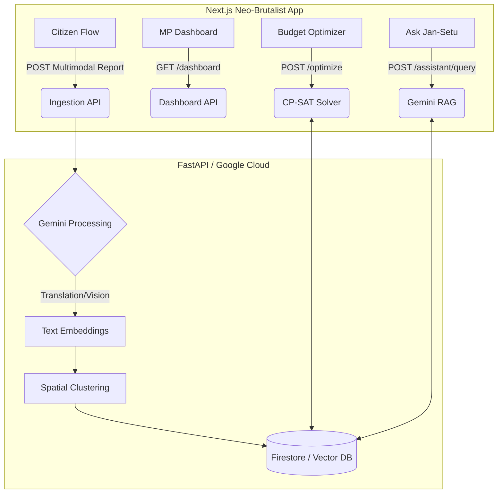

# Jan-Setu 🌉

> **AI-native civic intelligence platform that helps governments prioritize what communities actually need.**

[](https://cloud.google.com/)
[](https://fastapi.tiangolo.com/)
[](https://nextjs.org/)
[](https://opensource.org/licenses/MIT)

Jan-Setu is a civic-tech platform that transforms unstructured, multilingual, and multimodal citizen complaints into **budget-optimized infrastructure interventions** for Members of Parliament (MPs). It uses Google Gemini and OR-Tools CP-SAT solvers to model complex governance constraints and provide explainable AI recommendations.

---

## 🎯 Problem Statement

Members of Parliament in India receive ₹5 Crores annually (MPLADS) for local area development. However, allocation decisions are often based on fragmented, unstructured citizen complaints (letters, emails, WhatsApp). MPs lack the data modeling required to prioritize projects that maximize civic impact while adhering to strict category budget caps.

## 💡 The Solution

Jan-Setu replaces the traditional complaint inbox with an **Autonomous AI Pipeline**.

1. **Ingest**: Citizens submit messy, multimodal reports (voice, images, text) in any language.
2. **Process**: Google Gemini translates, categorizes, severity-scores, and extracts geo-locations.
3. **Cluster**: Reports are embedded and clustered into "Verified Issues" (e.g., 50 pothole reports become 1 "Road Repair Project").
4. **Optimize**: An OR-Tools CP-SAT solver allocates the ₹5 Cr budget across clustered projects to maximize total civic impact, constrained by sector caps (e.g., max 25% on Roads).
5. **Explain**: A Gemini-powered RAG assistant ("Ask Jan-Setu") explains the solver's decisions and citations directly to the MP.

## 🏗 Architecture & System Flow



*(See the `docs/` folder for deeper architectural breakdowns).*

## 🚀 Key Features

* **Multimodal Intake**: Submit reports via voice or images.
* **Budget Simulation Solver**: Adjust total MPLADS budget live and watch the CP-SAT solver instantly re-allocate funds.
* **Ask Jan-Setu (Grounded RAG)**: Query the constituency data. The AI explains exactly *why* a ward was bypassed for funding due to category caps.
* **"No-Popup" Spatial Dashboard**: A densely connected UI where map markers, the live feed, and AI citations stay completely synchronized.
* **Public Trust Portal**: Closing the loop by displaying AI-audited project completion rates to the public.

## 🛠 Tech Stack

* **Google Cloud**: Gemini 1.5 Flash (Vision/Text), Text Embeddings, Firestore.
* **Backend**: Python, FastAPI, OR-Tools (CP-SAT), Pydantic.
* **Frontend**: Next.js (App Router), React Query, Zustand, Framer Motion, Leaflet, React Three Fiber (R3F).

---

## 💻 Running Locally

### Prerequisites
* Docker & Docker Compose
* Google Gemini API Key

### Quickstart

1. **Clone & Configure**:
   ```bash
   git clone https://github.com/Zish19/Jan-Setu.git
   cd Jan-Setu
   cp .env.example .env
   # Add your GEMINI_API_KEY to .env
   ```

2. **Launch with Docker**:
   ```bash
   docker compose up --build
   ```

3. **Access**:
   * Frontend App: `http://localhost:3000`
   * Backend Swagger API: `http://localhost:8000/docs`

---

## 🎥 Presenter Demo Mode

Jan-Setu includes a built-in automated **Presenter Mode** tailored for 2-minute hackathon judging. 

1. Launch the frontend.
2. Press the `Start Live Demo` global shortcut (or trigger via the UI).
3. The XState FSM orchestrator will autonomously navigate through the Citizen Flow, AI Pipeline visualization, Budget Optimizer, and RAG Assistant.

---

## 📚 Documentation
Detailed documentation is available in the [`docs/`](./docs) directory:
- [System Architecture](./docs/architecture.md)
- [AI Pipeline Design](./docs/ai-pipeline.md)
- [Optimization Model](./docs/optimizer.md)
- [Deployment Guide](./docs/deployment.md)

## 📄 License
MIT License.
