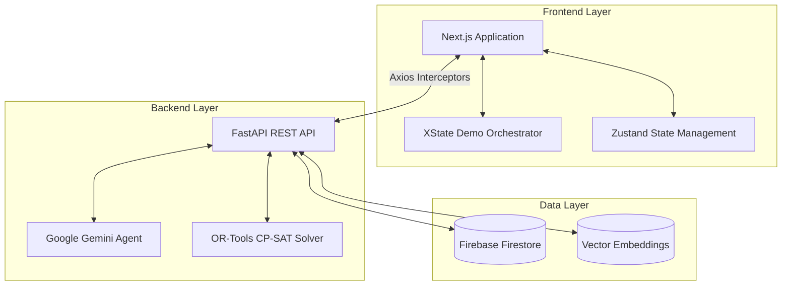
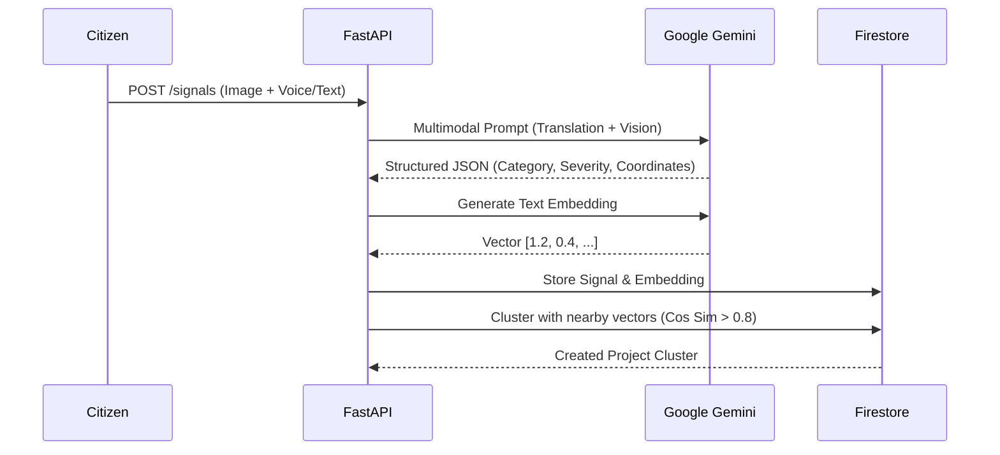
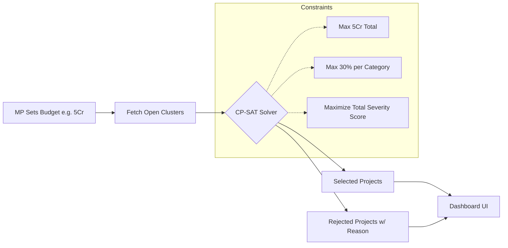

# Jan-Setu Architecture

Jan-Setu is a monorepo application structured around a FastAPI backend and a Next.js (React) frontend. It prioritizes autonomous AI pipelines, real-time optimization, and seamless UI synchronization.

##  High-Level System Design

##  The AI Pipeline

The pipeline processes chaotic incoming reports into structured intelligence.

##  Budget Optimization Flow

When the MP sets a budget in the dashboard, the OR-Tools solver takes over.

##  RAG Assistant (Ask Jan-Setu)

The RAG Assistant bridges the gap between the complex solver results and plain-english explainability.

1. MP asks: "Why wasn't the park in Ward 5 funded?"
2. FastAPI retrieves recent Optimization runs and the Ward 5 cluster details.
3. Gemini processes the constraints context.
4. Gemini responds: "Ward 5 Park (40L) was deferred because the Parks category reached its 15% budget cap. Funding it would violate the fairness constraint."
